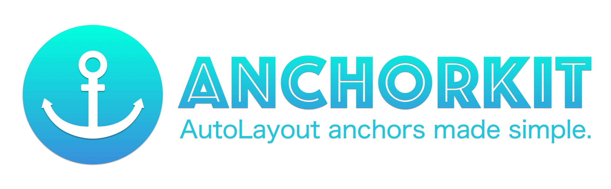

[](https://github.com/Carthage/Carthage)
[](https://img.shields.io/cocoapods/v/AnchorKit.svg)
[](http://cocoapods.org/pods/AnchorKit)
[](https://travis-ci.org/Weebly/AnchorKit)

### ***AnchorKit** provides a simple, intuitive way to create layouts using anchors.*

# Quick Start
Here's some example code:

````swift
// Multiple constraints on one line
myView.constrain(.leading, .top, .trailing, to: anotherView)

// One-line edge constraints with insets
myView.constrainEdges(to: anotherView).inset(10)
myView.constrainEdges(to: anotherView).insetVertical(20).insetHorizontal(30)

// Set height/width equal to a constant
myView.constrain(.height, .width, toConstant: 200)
myView.constrainWidth(to: 42)

// Set the height/width equal to a CGSize
myView.constrain(to: CGSize(width: 100, height: 200))

// Set offset (constant)
myView.constrain(.leading, to: .trailing, of: anotherView).offset(20)

// Set insets
myView.constrain(.leading, .trailing, to: anotherView).inset(24)

// Set the relation and multiplier
myView.constrain(.height, relation: .lessThanOrEqual, to: anotherView, multiplier: 1.6)

// Set the priority
myView.constrain(.centerY, to: anotherView, priority: .high).offset(-15)

// Easily center items
myView.constrainCenter(to: anotherView)

// Return value for single constraint is NSLayoutConstraint
let bottomConstraint = myView.constrain(.bottom, to: .top, of: anotherView.layoutMarginsGuide)

// Return value for multiple constraints is [NSLayoutConstraint]
let topAndSideConstraints = myView.constrain(.leading, .trailing, .top, to: anotherView)
````

# Features

- Simple, intuitive, Swifty syntax
- No more `isActive = true` after every line (**constraints are returned pre-activated** 🎉) 
- Automatically takes care of `translatesAutoresizingMaskIntoConstraints = false`
- Works with both **layout guides and views**
- Works on **all 3 platforms** that support AutoLayout constraints (iOS, macOS, tvOS)
- No proprietary classes to deal with; return values are `NSLayoutConstraint` or `[NSLayoutConstraint]`
- Use any number types (`Int`, `Double`, `Float`, etc.), no need to cast to `CGFloat`


# Requirements

- iOS 9.0+, macOS 10.11+, tvOS 9.0+
- Swift 4+, 3.2 or 3.1
- Xcode 8 or 9+


# Installation

### CocoaPods:
````
pod 'AnchorKit'
````

### Carthage:
````
github "Weebly/AnchorKit"
````

# Usage

## The `Anchor` Enum
**AnchorKit**'s API is primarily based on an enum representing the different anchor types available on views and layout guides.

````swift
public enum Anchor {
    case leading
    case trailing
    case left
    case right
    case top
    case bottom
    case width
    case height
    case centerX
    case centerY

    // These two are only available on views, not layout guides.
    case firstBaseline
    case lastBaseline
}
````

AutoLayout defines 3 types of anchors, and you can only constrain anchors to other anchors within the same group.

- **X-axis anchors**: `leading`, `trailing`, `left`, `right`, `centerX`
- **Y-axis anchors**: `top`, `bottom`, `centerY`, `firstBaseline`, `lastBaseline`
- **Dimension anchors**: `width`, `height`


Under the hood, each of these map to an actual `NSLayoutAnchor` on the view or layout guide you are constraining.

## Creating Constraints

### The `Anchorable` Protocol
**AnchorKit** works on both layout guides and views. To consolidate these two, we use a protocol called `Anchorable`. Views conform to another protocol, `ViewAnchorable`, which gives them the ability to use baseline anchors. Mentions of "item" in the docs below refer to views and layout guides.

### Anchor to Item Constraints

Constrain anchors of one item to the corresponding anchors of another item.

````swift
myView.constrain(.leading, .trailing, .top, to: anotherView)
````

Calling this method with a single anchor will implicitly return `NSLayoutConstraint`. Otherwise, the return type is `[NSLayoutConstraint]`. The full signatures of these methods are shown below.

````swift
// Single constraint
@discardableResult
public func constrain<AnchorableType: Anchorable>(_ anchor: Anchor, relation: NSLayoutRelation = .equal, to item: AnchorableType, multiplier: CGFloatRepresentable = 1, priority: LayoutPriority = .required) -> NSLayoutConstraint

// Multiple constraints
@discardableResult
public func constrain<AnchorableType: Anchorable>(_ anchors: Anchor..., relation: NSLayoutRelation = .equal, to item: AnchorableType, multiplier: CGFloatRepresentable = 1, priority: LayoutPriority = .required) -> [NSLayoutConstraint]
````

### Anchor to Anchor Constraints

Constrain an anchor of one item to an anchor of another item.

````swift
myView.constrain(.top, to: .bottom, of: anotherView.readableContentGuide)
````

This method only supports the creation of a single constraint.

````swift
@discardableResult
public func constrain<AnchorableType: Anchorable>(_ anchor: Anchor, relation: NSLayoutRelation = .equal, to otherAnchor: Anchor, of item: AnchorableType, multiplier: CGFloatRepresentable = 1, priority: LayoutPriority = .required) -> NSLayoutConstraint
````

### Anchor to Constant Constraints

Constrain an anchor of an item to a constant. This is is especially useful (and more readable) for the `width` and `height` anchors.

````swift
myView.constrain(.height, toConstant: 200)
myBoxView.constrain(.width, .height, toConstant: 50) // Creates a box

// Even easier:
myView.constrainHeight(to: 42)
myView.constrainWidth(to: 60)
````

Calling this method with a single anchor will implicitly return `NSLayoutConstraint`. Otherwise, the return type is `[NSLayoutConstraint]`. The full signatures of these methods are shown below.


````swift
// Single constraint
@discardableResult
public func constrain(_ anchor: Anchor, relation: NSLayoutRelation = .equal, toConstant constant: CGFloatRepresentable, priority: LayoutPriority = .required) -> NSLayoutConstraint

// Multiple constraints
@discardableResult
public func constrain(_ anchors: Anchor..., relation: NSLayoutRelation = .equal, toConstant constant: CGFloatRepresentable, priority: LayoutPriority = .required) -> [NSLayoutConstraint]
````

This method can also work on items with anchors other than `width` and `height`. The resulting behavior is equivalent to constraining the anchor to the corresponding anchor on the view's `superview` (or layout guide's `owningView`). So `myView.constrain(.leading, toConstant: 10)` translates to `myView.constrain(.leading, to: myView.superview!).offset(10)`.


### Constrain to Edges

Constrains the edges of the current item to another item. 

````swift
myView.constrainEdges(to: anotherView)
````

This is just a convenience method for constraining the `leading`, `trailing`, `top`, and `bottom` anchors. For better autocomplete behavior, there is a separate equivalent method if you would like to add a `relation` other than `.equal` to the constraints.

````swift
@discardableResult
public func constrainEdges<AnchorableType: Anchorable>(to item: AnchorableType, priority: LayoutPriority = .required) -> [NSLayoutConstraint]

// With a relation other than .equal
@discardableResult
public func constrainEdges<AnchorableType: Anchorable>(_ relation: NSLayoutRelation, to item: AnchorableType, priority: LayoutPriority = .required) -> [NSLayoutConstraint]
````

### Constrain to Center

Constraints the center of the current item to another item.

````swift
myView.constrainCenter(to: anotherView)
````

Thiis is just a convenience method for constraining the `centerX` and `centerY` anchors. For better autocomplete behavior, there is a separate equivalent method if you would like to add a `relation` other than `.equal` to the constraints.


````swift
@discardableResult
public func constrainCenter<AnchorableType: Anchorable>(to item: AnchorableType, priority: LayoutPriority = .required) -> [NSLayoutConstraint]

// With a relation other than .equal
@discardableResult
public func constrainCenter<AnchorableType: Anchorable>(_ relation: NSLayoutRelation, to item: AnchorableType, priority: LayoutPriority = .required) -> [NSLayoutConstraint]
````

### Constrain to Size

Constrains the width and height of an item to a specific `CGSize`.

````swift
myView.constrain(to: CGSize(width: 10, height: 20))
````

This is a convenience method for setting the `width` and `height` anchors to the respective width and height of a `CGSize`. For better autocomplete behavior, there is a separate equivalent method if you would like to add a `relation` other than `.equal` to the constraints.

````swift
@discardableResult
public func constrain(to size: CGSize, priority: LayoutPriority = .required) -> [NSLayoutConstraint]

@discardableResult
public func constrain(_ relation: NSLayoutRelation, to size: CGSize, priority: LayoutPriority = .required) -> [NSLayoutConstraint]
````

For views, because width and height constraints belong to the view itself, you can update the those constraints directly from the view:

````swift
myView.updateSize(newSize)
myView2.updateWidth(100)
myView3.updateHeight(200)
````

### Constrain to UIViewController `topLayoutGuide` and `bottomLayoutGuide`

The `topLayoutGuide` and `bottomLayoutGuide` properties on `UIViewController` have a type of `UILayoutSupport`, which is a protocol. Constrain to these just as you would to any other item. 

Note that the only anchors available on these are `height`, `top`, and `bottom`.

````swift
myView.constrain(.top, to: .bottom, of: topLayoutGuide).offset(10)
otherView.constrain(.height, to: bottomLayoutGuide)
````
The signatures for these methods are identical to the anchor-to-anchor and anchor-to-item methods except that the second item has a type of `UILayoutSupport`.

## The `CGFloatRepresentable` Protocol

This protocol allows you to use any number types for constraint offsets, insets, and multipliers without the need to cast all values to `CGFloat`.

````swift
public protocol CGFloatRepresentable {
    var cgFloatValue: CGFloat { get }
}
````

Adopted by the following types:

- `Int`, `Int8`, `Int16`, `Int32`, `Int64`
- `UInt`, `UInt8`, `UInt16`, `UInt32`, `UInt64`
- `Double`
- `Float`, `Float80`
- `CGFloat`
- `NSNumber`

## Offsets and Insets

To set constants on constraints, **AnchorKit** uses *offsets* and *insets*. An offset has equivalent behavior to `constant` on `NSLayoutConstraint`. An inset, however, *negates* the constant for the `trailing`, `right`, `bottom`, and `lastBaseline` anchors and behaves normally for all other anchors.

````swift
// The top of bottomView will be 20 points below the top of topView
bottomView.constrain(.top, of: topView).offset(20)

// The innerView will be "inside" the outerView, with 10 points of padding on the sides
innerView.constrain(.leading, .trailing, to: outerView).inset(10)
````

As you may have noticed in the second example, `offset(_:)` and `inset(_:)` work on both single constraints and sequences of constraints.

When updating constraints, for the sake of proper Swift naming conventions, **AnchorKit** also provides the methods `updateOffset(_:)` and `updateInset(_:)`.

You can also use `UIEdgeInsets` (or `EdgeInsets` on macOS) to set the insets. The insets will be applied to the corresponding constraints.

````swift
innerView.constrainEdges(to: outerView).inset(UIEdgeInsets(top: 10, left: 12, bottom: 14, right: 16))
````

For multiple constraints, it's also possible to only set the *horizontal* and *vertical* insets, like so:

````swift
// The innerView will have an inset of 10 on the top and bottom sides and an inset of 20 on the leading and trailing sides
innerView.constrainEdges(to: outerView).insetVertical(10).insetHorizontal(20)`
````
When updating horizontal/vertical inset, use `updateHorizontalInsets(_:)` and `updateVerticalInsets(_:)`.

## Layout Priorities

To set priorities on constraints, **AnchorKit** provides an enum called `LayoutPriority`.

````swift
public enum LayoutPriority: RawRepresentable {
    case low        // Priority: 250
    case medium     // Priority: 500
    case high       // Priority: 750
    case required   // Priority: 1000
    case custom(Float)
}
````

All of the constraint creation methods have a default priority of `required`, but you can set your own when needed.

````swift
myView.constrain(.centerX, to: anotherView, priority: .medium)
````

For complex layouts, sometimes you want just a *slightly* higher priority for one constraint. Good news: you can use addition and subtraction operators with layout priorities.

````swift
myView.constrain(.left, to: anotherView, priority: .low + 1) // Priority = 251
````

You can get/set the layout priority on `NSLayoutConstraint`s with the `layoutPriority` extension method.

````swift
let topConstraint = myView.constrain(.top, to: anotherView, priority: .medium)
topConstraint.layoutPriority = .high
````

And finally, use layout priorites to set your content compression resistance and content hugging:

````swift
myView.hug(with: .low, for: .vertical)
myView.resistCompression(with: .high, for: .horizontal)
````

## Other Goodies

### Activation & Deactivation

**AnchorKit** constraints come *preactivated*. However, you can also deactivate constraints and capture them on the same line:

````swift
let centerYConstraint = myView.constraint(.centerY, to: anotherView).deactivate()
// ...
centerYConstraint.activate()
````
These methods also work on sequences of constraints.

### iOS 11 System Spacing Constraints

In iOS 11 and tvOS 11, UIKit gave us a new way to define constraints using system-defined spacing with methods such as `constraintEqualToSystemSpacingAfter(_:multiplier:)`. These are useful when constraining items to the new `safeAreaLayoutGuide` found on `UIView`, which is now the recommended API to use instead of `topLayoutGuide` and `bottomLayoutGuide` on `UIViewController` (those are now deprecated). 

AnchorKit provides a higher level method for system spacing constraints:

````swift
myView.constrainUsingSystemSpacing(.top, .below, .bottom, of: anotherView.safeAreaLayoutGuide)
myView.constrainUsingSystemSpacing(.leading, .after, .trailing, of: anotherView.safeAreaLayoutGuide)
````

The full signature for this method is below:

````swift
@discardableResult
public func constrainUsingSystemSpacing<AnchorableType: Anchorable>(_ anchor: Anchor, relation: Relation = .equal, _ position: SystemSpacingPosition, _ otherAnchor: Anchor, of item: AnchorableType, multiplier: CGFloatRepresentable = 1, priority: LayoutPriority = .required) -> NSLayoutConstraint
````


# Support
For questions, support, and suggestions, please open up an issue.

# License
**AnchorKit** is available under the MIT license. See the LICENSE file for more info.


